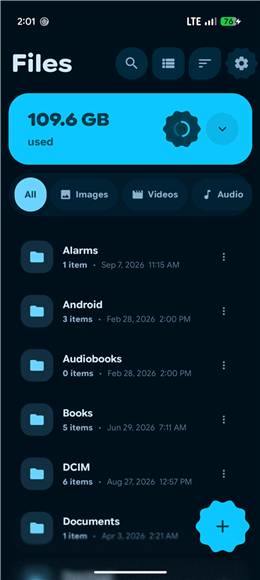
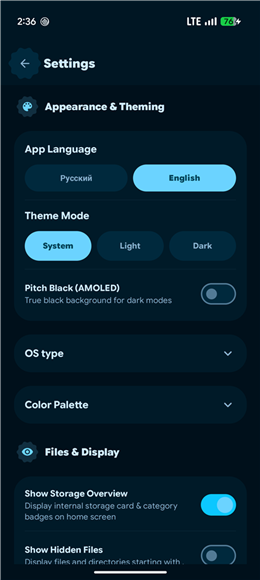

<p>
  
</p>

# Expressive Files

A fast, expressive Material 3 file manager for Android with a built-in archive engine and a fluid physics-based UI. Built entirely with Kotlin and Jetpack Compose.

<p>
  
  
  
  
</p>

## Screenshots

<p>
  
  
  
</p>

## Features

### File management
- Browse internal storage with **Grid, List, and Expressive Cards** view modes
- Create, rename, copy, move, and delete files and folders
- Type-filter chips (images, video, audio, documents, code, APKs, archives) with capped, responsive category listings
- Full-text **search** with result capping for large folders
- Sort by name, date, or size in either direction
- Open files in external apps or share them via the system share sheet
- **Storage analysis** dashboard with a storage hero card and per-category drill-down
- Hardened operations: path-traversal rejection in create/rename, copy/move-into-own-tree rejection, and batch moves that never half-complete (all pinned by regression tests)

### Archive engine (no external tools needed)
| Format | Create | Extract | Browse contents |
|--------|:------:|:-------:|:---------------:|
| ZIP    | ✅ | ✅ | ✅ |
| 7Z     | ✅ | ✅ | ✅ |
| TAR    | ✅ | ✅ | ✅ |
| TAR.GZ | ✅ | ✅ | ✅ |
| RAR    | — | ✅ | ✅ |

Archive creation and extraction run with live progress reporting, powered by Apache Commons Compress, XZ for Java, and junrar.

### Expressive UI
- **Expressive Material You styling**: stock-*Pixel* look with chunky "cookie" buttons, sheets, and switches
- **Seven color palettes** including Dynamic Material You wallpaper theming, Neon Violet, Cyber Teal, Sunset Coral, Emerald Mint, and Citrus Gold
- System / light / dark theme modes
- Physics-based motion: elastic scroll-follow for floating strips and the FAB, springy enter transitions, and glassmorphism (real-time blur) chrome
- Custom hand-drawn "cookie" shapes for icon buttons
- In-app **language switcher** (English / Русский) that applies instantly — all locales ship in the base module

## Tech stack

| Layer | Choice |
|-------|--------|
| Language | Kotlin 2.4 |
| UI | Jetpack Compose, Material 3 (BOM 2026.09) |
| Architecture | MVVM (`FileViewModel` + StateFlow) |
| Blur | [Haze](https://github.com/chrisbanes/haze) |
| Images / video thumbnails | Coil (incl. `coil-video`) |
| Archives | Commons Compress + XZ + junrar |
| DI | Manual (viewModels + repositories) |
| Testing | JUnit4, Robolectric, Compose UI tests, Roborazzi screenshot tests |

## Project layout

```
app/src/main/java/com/baiel/expressivefiles/
├── archive/       # ArchiveEngine: create/extract/inspect ZIP, 7Z, TAR, TAR.GZ, RAR
├── data/          # FileManagerRepository, SettingsRepository
├── model/         # FileItem, AppSettings, enums (themes, sort, view modes…)
├── ui/
│   ├── components/  # File cards, dialogs, elastic scroll, squiggly indicators
│   ├── screens/     # Home, settings, storage analysis (+ home/ chrome pieces)
│   └── theme/       # Palettes, shapes, typography
├── util/          # Coil helpers
└── viewmodel/     # FileViewModel
```

## Building

Requirements: **Android Studio** (latest stable) with SDK 37, JDK 17+.

1. Clone the repository:
   ```bash
   git clone https://github.com/llvl11/File-manager2.git
   ```
2. Open the project in Android Studio and let Gradle sync.
3. Optional secrets live in a `.env` file at the repo root (see `.env.example`). None are required to build and run the app.
4. Run it on a device or emulator running **Android 15 (API 35) or newer**.

Or from the command line:

```bash
# Debug APK
./gradlew :app:assembleDebug

# Unit tests (Robolectric — no device needed)
./gradlew :app:testDebugUnitTest

# Lint
./gradlew :app:lintDebug
```

The app requests **MANAGE_EXTERNAL_STORAGE** ("All files access"), which must be granted from system settings on first launch — it is a core requirement for any full-storage file manager.

## Testing

The test suite runs on the JVM via Robolectric and covers:
- Compose UI chrome (sort strips, storage hero, drifting-overlay geometry) via `createComposeRule`
- File-operation regressions (traversal safety, same-directory moves, atomic batch behavior, copy preservation)
- Expressive component contracts (theme palettes, shapes, accessibility touch targets)
- Roborazzi screenshot tests for visual regression

```bash
./gradlew :app:testDebugUnitTest
```

## License

This project is licensed under the MIT License

